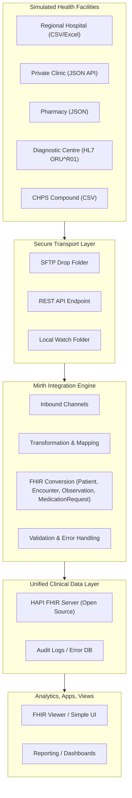
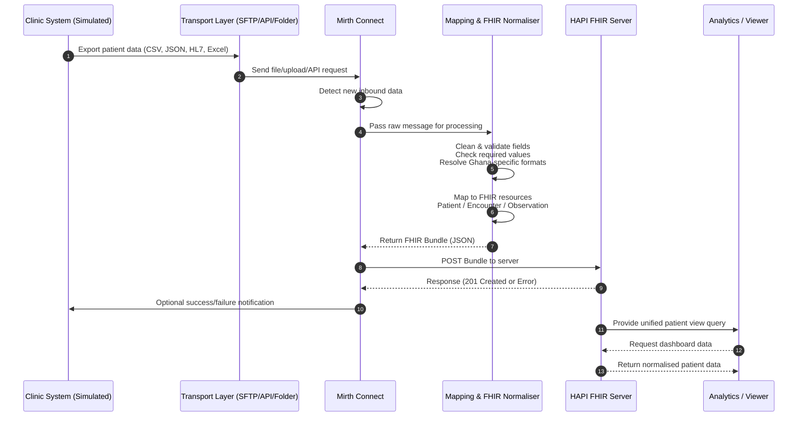

# Design and Implementation of a Patient Data Normalisation Platform for Multi-Clinic Interoperability in Ghana
## Background & Rationale

Ghana’s healthcare ecosystem comprises a mix of public hospitals, private clinics, pharmacies, Community-Based Health Planning and Services (CHPS) centres, diagnostic centres, and specialist facilities. These institutions often use different systems for recording patient information, ranging from Excel/CSV files to proprietary EMRs, HL7 (Health Level Seven) outputs from laboratory equipment, and manually digitised paper records.
This results in significant challenges:
- Patient information cannot easily move between facilities.
- National reporting (e.g., DHIMS2) relies on manual entry or inconsistent formats.
- Referral handovers between hospitals and clinics lack standardisation.
- Analytics, disease surveillance, and continuity of care become difficult.

With Ghana pursuing digital health transformation through the Ministry of Health (MoH), Ghana Health Service (GHS), and NHIS, the need to normalise and standardise health data is becoming central. A lightweight, open-source, standards-based platform is essential for practical interoperability across diverse clinical environments, particularly resource-constrained ones.

## Problem Statement
Healthcare facilities in Ghana produce and store patient data in different formats and structures with no unified interoperability standard. This makes it challenging to share patient information across institutions or support national-level health analytics initiatives.
There is a lack of a low-cost, flexible platform that transforms heterogeneous datasets into standardised Fast Healthcare Interoperability Resources (FHIR) based datasets.

## Project Goal
To build a working prototype of an integration and data-normalisation platform capable of transforming disparate health data formats into standardised FHIR resources, using Ghana-ready data workflows.

Below are two complete Mermaid diagrams:
- High-Level Architecture Diagram
- End-to-End Sequence Diagram
The two diagrams aim to provide a general overview and understanding of the components that can be utilised to facilitate the solution.

### Process Flow Sequence Diagram

This diagram shows the exact student project workflow:
- Generated simulated clinical data
- Transport layer sends to Mirth
- Mirth processes + routes messages
- FHIR mapping + validation
- Unified data stored in HAPI FHIR server
The viewer consumes and displays normalised records.

This architecture works well as a student project for the following reasons :
- Allows us to demonstrate fundamental Extract, Transform, Load (ETL) skills
- Allows the understanding of healthcare data structures and how they work
- Facilitates the use of open source tools to build FHIR-like normalisation logic
- We have the option to use our own developed engine, tapping into the use of native SSIS + Python + PowerShell in a coordinated system ( in a scenario when we want to establish our own transformation engine without relying on Mirth Connect )
- We can simulate real clinics without needing real patient data
- We can show dashboards, queries, or analytics on normalised data
